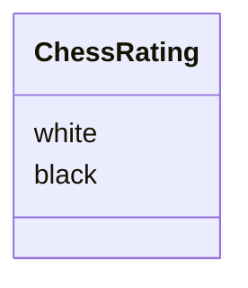

# Architecture

This contains all the higher-level explanations of the different
parts of this project. All the single-function documentation
is already in the docstrings of the funcs so therefore I don't
"crosspost" those here.

## Structure

### Chess
The `chess` takes care of the rating calculations of players. It
can calculate new ratings of two players after a played game
depending on the result.





Here is an example use if you need to calculate new ratings for two
players after having played a game.

```python
from src.chess import ChessRating

# create a ChessRating object with the old ratings and add a game result
ratings = ChessRating(white_initial_rating, black_initial_rating)
ratings.game_result(1, 0)

# new ratings can be accessed with class properties black and white
white_new_rating = ratings.white
black_new_rating = ratings.black
```


`ChessRating` uses few helper functions to calculate the final
rating.
* `expected_scores()`
* `calculate_chess_rating(white_adjustment, black_adjustment)`

These functions are called by the `game_result()` method.
* `expected_scores()` calculates the likelihood of each player
winning that is needed for the final formula to calculate the ratings.
The expected score is based on the rating difference.

> "It then follows that for each 400 rating points of advantage over
the opponent, the expected score is magnified ten times in
comparison to the opponent's expected score." ~[Elo rating system](https://en.wikipedia.org/wiki/Elo_rating_system#Mathematical_details)

* `calculate_chess_rating(white_adjustment, black_adjustment)`
calculates the rating with the expected score. More information
about the formula can be found from [wikipedia](https://en.wikipedia.org/wiki/Elo_rating_system#Theory).
The adjustment values mentioned in the parameters are the amount
the rating is wanted to change per one game. In this project at
the moment the value is `24` when according to the formula
$K=16$ is for masters and $K=32$ is for weaker players.


### Config
The `config` takes care of the environment variables. It reads the `.env` file in the root of the project for `POSTGRES_URL`,
`TEST_POSTGRES_URL` and `ENV`. These can be used by invoking the functions
* `db_url()`
* `env()`

The `TEST_POSTGRES_URL` is reserved for tests.
The environment variables can be used by importing and calling the
correct function.

```python
from src import config

env = config.env()
db_url = config.db_url()
```

### Database
The database is accessed with functions in the `database` folder.
All database functions utilize a `sqlalchemy` engine to create connection
to the database. This engine is created in the `src/__init__.py` file, but
alternative engines can be provided.

#### Game
This folder contains all query-functions that interact with the sql table `Games`

* `get_all_games()` returns all played games
* `create_game(white_id, black_id, result, rated)` used to insert a new game to the database

#### Ratings
This folder contains all query-functions that interact with users' ratings.

* `get_user_rating(user_id)` returns user's rating with the user's id
* `get_ratings()` returns all users' ratings
* `update_user_rating(user_id, new_rating)` updates user's rating to the database
* `update_ratings_with_game_result(white_id, black_id, result)` updates both users' ratings to the
database with the given game result. Used by the api when creating a new game.

#### User
This folder contains all query-functions that interact with users in general.

* `check_username(username)` queries the database for user id with the user's username
and returns a boolean if the id exists.
* `get_username(user_id)` returns the username with the corresponding id.
* `get_user_id(username)` returns the user's id with the corresponding username. 
* `get_user_data(user_id)` returns all fields (columns in sql) of an user.
* `get_all_users()` returns all users in the database.
* `create_user(username, rating)` inserts a new user with an unique username to the database.

#### Helper
Contains (a single) universal helper function that can be used by all of the
previous modules.

* `check_user_exists(user_id)` checks if there is an user with the id given. The functionality is
rather close with other functions in the `user` file and the function could be removed later due
to repeated code.


## API
Project uses `fastapi` to serve the data as an api over `http` for
easy access. With this implementation the api can be used as
a backend to a frontend app.

### Paths
This is an exhaustive list of all api paths.

#### /api/users
* GET [localhost:8000/api/users](http://localhost:8000/api/users) returns all users in the database with their `id`, `username` and `rating`.
* POST [localhost:8000/api/users](http://localhost:8000/api/users) adds user given in the request body, ex. 
{"username": "<wanted_name>", "rating": <int>}.
* GET [localhost:8000/api/users/<user_id>](http://localhost:8000/api/users/<user_id>) returns same data but of one user (selected by id).
* PUT [localhost:8000/api/users/<user_id>](http://localhost:8000/api/users/<user_id>) updates the user's rating with a value given in the
request body. For ex. {"rating": <new_rating: int>}

#### /api/rating
* GET [localhost:8000/api/rating](http://localhost:8000/api/rating) returns all users in the database with their `id`, `username` and `rating` *sorted by their rating*.
* GET [localhost:8000/api/rating/<user_id>](http://localhost:8000/api/rating/<user_id>) returns the rating of the user with corresponding id.

#### /api/games
* GET [localhost:8000/api/games](http://localhost:8000/api/games) returns all games in the database.
* POST [localhost:8000/api/games](http://localhost:8000/api/games) creates a new game with the values given in the request body. 
{"white_id": <user_id>, "black_id: <ohter_user_id>, "result": <one of "1-0", "0-1" or "0.5-0.5">, "rated": <boolean (defaults to True)>}


