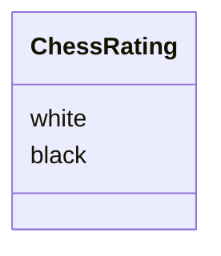

# Architecture

This contains all the higher-level explanations of the different
parts of this project. All the single-function documentation
is already in the docstrings of the funcs so therefore I don't
"crosspost" those here.

## Structure

### Chess
The `chess` takes care of the rating calculations of players. It
can calculate new ratings of two players after a played game
depending on the result.

### Config
The `config` takes care of the environment variables. It reads the `.env` file in the root of the project for `POSTGRES_URL`,
`TEST_POSTGRES_URL` and `ENV`. These can be used by invoking the functions
* `db_url()`
* `env()`
The `TEST_POSTGRES_URL` is reserved for test mocking.
The environment variables can be used with `from src import config` and then accessing the functions with `config.`. prefix.

### Database
The `db.py` handles the interaction with the database. All queries are implemented as functions in this file.
Example functions are
* `get_all_users()` returns a list of all users
* `get_user_rating(user_id)` returns the rating of the user with user_id
* `create_user(username, rating)` creates new user with the given params

The most important function however is the `create_db_connection(engine)`.
The function returns a connection to the database that can be then
used to query it. It needs an `sqlalchemy` engine (created with `sqlalchemy.create_engine()`, see sqlalchemy docs).
In this project the engine is created in `__init__.py`.

###

## API
Project uses `fastapi` to serve the data as an api over `http` for
easy access. With this implementation the api can be used as
a backend to a frontend app.

### Paths

Only users path is functional by now, others are placeholders.

#### /api/users

* GET [users](http://localhost:8000/api/users) returns all users in the database with their `id`, `username` and `rating`
* POST [users](http://localhost:8000/api/users) adds user given in the request body, ex. {"username": "<wanted_name>", "rating": <int>}
* GET [users](http://localhost:8000/api/users/<user_id>) returns same data but of one user (selected by id)

#### /api/rating

* GET [users](http://localhost:8000/api/rating) returns all users in the database with their `id`, `username` and `rating` *sorted by their rating*
* GET [users](http://localhost:8000/api/rating/<user_id>) returns the rating of the user with corresponding id

#### /api/chess

* GET [users](http://localhost:8000/api/chess) returns all games in the database

#### /api/search
This is purely an idea, could possibly be dropped at any moment

* GET [users](http://localhost:8000/api/search) ability to search the games or users somehow, dont know yet.
* GET [users](http://localhost:8000/api/search/user/<username>) search users by username
